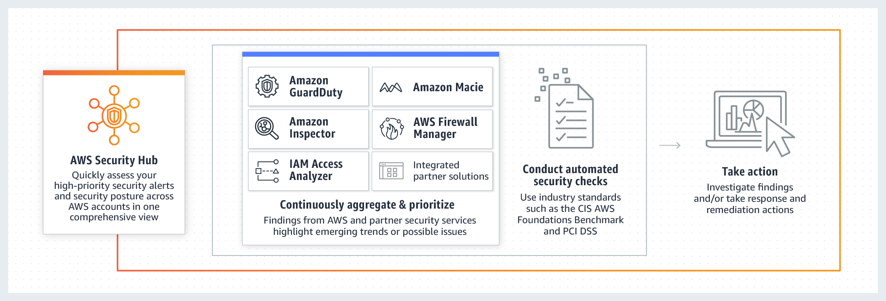

# AWS Security Services

## Amazon GuardDuty
Amazon GuardDuty is a threat detection service that continuously monitors your AWS accounts and workloads for malicious activity and delivers detailed security findings for visibility and remediation

## AWS Security Hub
AWS Security Hub provides you with a comprehensive view of your security state in AWS and helps you assess your AWS environment against security industry standards and best practices.

Security Hub collects security data across AWS accounts, AWS services, and supported third-party products and helps you analyze your security trends and identify the highest priority security issues.

